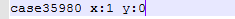
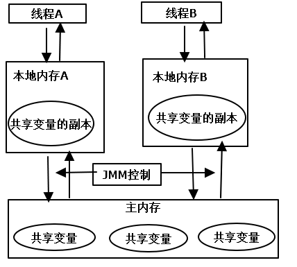
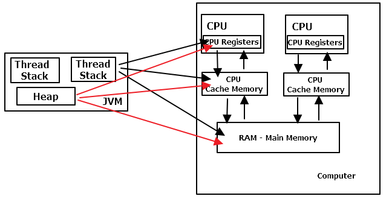
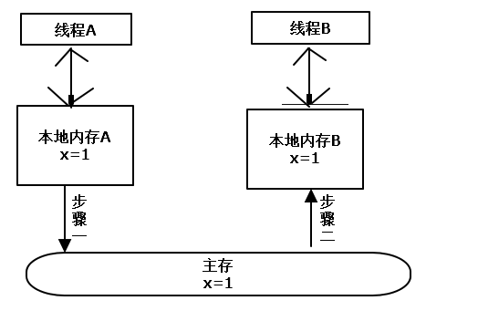
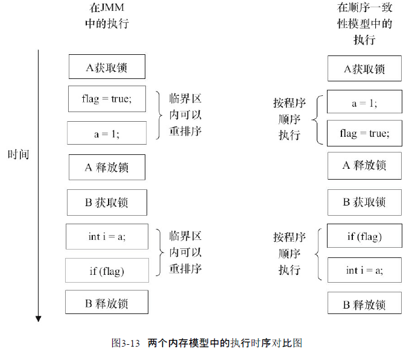

CPU乱序执行的结果  

x=0,y=1  
  

x=1,y=0  
  

x=y=0  
  

出现这几种情况的原因分析： 
 
## 线程之间如何通信？
    线程之间通信机制有两种：共享内存和消息传递。  
### 共享内存
    通过写-读主内存中的变量值进行隐式的通信。  
### 消息传递
    通过发送消息显示进行通信。  
## 线程之间如何同步？
    共享内存模型中，需要在程序中指定某个方法或某段代码需要在线程之间互斥执行。  
    消息传递模型中：消息的发送必须在消息的接收之前。   
## 可见性问题
    可见性的意思是当一个线程修改一个共享变量时，另外一个线程能读到这个修改的值。  
    java中的并发采用的是共享内存模型的方法。共享内存是什么呢？我们知道JVM中堆内存和方法区(这里区分开来了)是在线程之间共享的。  
    那么这部分内存都包含什么东西呢？包含实例域、静态域、数组元素等。它们又可以称为共享变量。  
    java并发线程之间的通信是由java内存模型(JMM)控制的，JMM决定了一个线程对共享变量的写入何时对另一个线程可见(在默认的情况下，JVM并不要求每个变量在任意时刻都保持同步，这句话很重要！)。JMM可以做这样的一个抽象：  
    线程之间的共享变量存储在主内存中，每个线程都有一个私有的本地内存(或者成为工作内存),本地内存中存储了该线程读-写共享变量的副本。本地内存是JMM的一个抽象概念，
    它涵盖了缓存、写缓冲区、寄存器以及其他的硬件和编译器优化。  
## 写缓冲区
    现代处理器使用写缓冲区临时保存向内存写入的数据，写缓冲区可以保证指令流水线持续运行，  
    它可以避免由于处理器停顿下来等待向内存写入数据而产生的延迟。同时，通过以批处理的方式  
    刷新写缓冲区，以及合并写缓冲区对同一内存地址的多次写，减少对内存总线的占用。每个处理器上  
    的写缓冲区，仅仅对它所在的处理器可见。这个特性会导致处理器对内存的读/写操作的执行顺序  
    不一定与内存实际发生的读/写操作顺序一致。
JMM抽象模型
  
JMM硬件映射
  
  
## 线程之间通信
    线程A和线程B之间要通信的话，必须要经历下面这两个步骤：  
    1)、线程A把本地内存A中更新过的共享变量刷新到主内存中去。  
    2)、线程B到主内存中去读取线程A之前已更新过的共享变量。  
    线程间通信如下图所示
  
  
    具体的通信过程：  
    刚开始时，本地内存A和本地内存B中都保存了一份共享变量X的副本，此时X的值为0。线程A在执行的时候，把更新  
    后的X值(假设值为1)临时存放在自己的本地内存A中。当线程A和线程B需要通信时，线程A首先会把自己本地内存中修改  
    后的X值刷新到主内存中，此时主内存中X的值变为了1，随后，线程B到主内存中去读取线程A更新后的X值，此时，  
    线程B的本地内存的X值也变为了1。
## 重排序  
### 重排序的目的
    提高性能
### 谁会做重排序的动作
    编译器和处理器
### 重排序的分类
    1)、编译器优化的重排序(循环里写固定代码)。编译器在不改变单线程程序语义的前提下，可以重新安排语句的执行顺序。这里需要注意的是：不改变单线程程序的语义。  
    2)、指令级并行的重排序。现代处理器采用了指令级并行技术(ILP)来将多条指令重叠执行。如果不存在数据依赖，处理器可以改变语句对应机器指令的执行顺序。  
    3)、内存系统的重排序(指令操作)。由于处理器使用缓存和读/写缓冲区，这使得加载和存储操作看上去可能是在乱序执行。  
    所以从java源代码到最终实际执行的指令序列，会分别经历下面三种重排序  
    源代码---->编译器优化重排序---->指令级并行重排序---->内存系统重排序---->最终执行的指令序列
### 重排序的后果
    可能导致多线程程序出现内存可见性问题。
### 禁止特定类型的处理器重排序 
    通过java编译器在生成指令序列时插入特定类型的内存屏障(Memory Barriers/Memory Fence)。
### 内存屏障的分类

|屏障类型|指令示例|说明|    
|-------|-------|----|
|LoadLoad Barriers|Load1;LoadLoad;Load2|确保Load1数据的装载先于Load2及所有后续装载指令的装载|
|StoreStore Barriers|Store1;StoreStore;Store2|确保Store1数据对其他处理器可见(刷新到内存)先于Store2及所有后续存储指令的存储|
|LoadStore Barrires|Load1;LoadStore;Store2|确保Load1数据装载先于Store2及所有后续的存储指令刷新到内存|
|StoreLoad Barriers|Strore1;StoreLoad;Load2|确保Store1数据对其他处理器变得可见(刷新到内存)先于Load2及所有后续装载指令的装载。
| | |StoreLoad Barriers会使该屏障之前的所有内存访问指令(存储和装载指令)完成之后，才执行该屏障之后的内存访问指令|

    StoreLoad Barriers是一个“全能型”的屏障，它同时具有其他3个屏障的效果，现代的多处理器大多支持该屏障      
    执行该屏障开销会很昂贵。因为当前处理器通常要把写缓冲区中的数据全部刷新到内存中。
    
## 指令重排序
    一条指令的执行是可以分为很多步骤的
        1)、取值 IF
        2)、译码和取寄存器操作数 ID
        3)、执行或者有效地址计算 EX
        4)、存储器访问 MEM
        5)、写回 WB  
     如下图所示(同一个操作不能在两个指令之间进行)
.png)
.png)
.png)
.png)
### 数据依赖
    如果两个操作访问同一个变量，且这两个操作中有一个为写操作，此时这两个操作之间就存在数据依赖。如下表所示：   
| 名称 | 代码示例 | 说明 |  
|------|------|----|
|      |      |    | 
|写后读| a=1;  |写一个变量之后，再读这个变量| 
|     | b=a;  |                        |
|写后写| a=1;  |写一个变量之后，再写这个变量| 
|     | a=2;  |                        | 
|写后读| a=b;  |度一个变量之后，再写这个变量| 
|     | b=1;  |                        | 

    上表中的三种情况，只要重排序两个操作的执行顺序，程序的执行结果就会被改变。  
    在上面我们说过，编译器和处理器会对操作做重排序。编译器和处理器在重排序时，会遵守  
    数据依赖性，编译器和处理器不会改变存在数据依赖关系的两个操作的执行顺序。  
    注意：这里说的数据依赖性仅针对单个处理器中执行的指令序列和单个线程中执行的操作。  
    不同处理器之间和不同线程之间的数据依赖性不被编译器和处理器考虑。
### as-if-serial语义
    as-if-serial语义的意思是：不管怎么重排序，在单线程中程序的执行结果不能被改变。  
    编译器、runtime和处理器都必须遵守as-if-serial语义。  
### 控制依赖性
    什么是控制依赖性？  
    像：if(条件){ 执行代码。。。 }这样的代码之间存在控制依赖性。  
    控制依赖性会导致什么问题？  
    当代码中存在控制依赖性时，会影响指令序列执行的并行度。为此，编译器和处理器会采用猜测(Speculation)执行来克服  
    控制依赖对并行度的影响。  
    硬件缓存中：重排序缓冲。  
    在单线程程序中，对存在控制依赖的操作重排序不会改变执行结果；但在多线程程序中，对存在控制依赖的操作重排序，可能会改变程序的执行结果。  
## 顺序一致性模型
### 顺序一致性内存模型
    顺序一致性内存模型是一个被理想化的理论参考模型，它为程序员提供了极强的内存可见性保证。顺序一致性内存模型有两大特性：  
    1)一个线程中的所有操作必须按照程序的顺序来执行。(即程序员认为的程序执行顺序和代码中写的顺序是一样的)  
    2)(不管程序是否同步)所有线程都只能看到一个单一的操作执行顺序。在顺序一致性内存模型中，每个操作都必须原子执行且立刻对所有线程可见。  
    顺序一致性内存模型的视图： 
.png)

    从上面的顺序一致性内存模型图中我们可以看出，在任意时间点最多只能有一个线程可以连接到内存。当多个线程并发执行时  
    图中的开关装置能把所有线程的所有内存读/写操作串行化。
    顺序一致性内存模型中正确同步的线程执行顺序：
.png)
    
    如果程序是正确同步的，程序的执行将具有顺序一致性。即程序的执行结果与改程序在顺序一致性内存模型中的执行结果相同。  
    顺序一致性内存模型中未正确同步的线程执行顺序：
.png)

    未同步的程序虽然在顺序一致性模型中整体执行顺序是无序的，但所有线程都只能看到一个一致的整体执行顺序。  
    以上图为例，线程A和B看到的执行顺序都是：B1→A1→A2→B2→A3→B3。之所以能得到这个保证是因为顺序一致性内存模型中的  
    每个操作必须立即对任意线程可见。  
    但是，在JMM中没有这个保证，未同步程序在JMM中不但整体的执行顺序是无序的，而且所有线程看到的操作执行顺序  
    也可能不一致。因为在当前线程会把写过的数据缓存在本地内存中，在没有刷新到主内存之前，这个写操作仅对当前线程可见(写缓冲区)。  
### 数据竞争与顺序一致性
     当程序未正确同步时，就可能会存在数据竞争，java内存模型规范对数据竞争的定义如下：  
     在一个线程中写一个变量，在另一个线程读同一个变量，而且写和读没有通过同步来排序。  
     当程序出现数据竞争时，程序的执行结果往往和我们预想的不一样。  
### 同步程序的顺序一致性效果
    程序执行如下所示：

    在JMM中，临界区内的代码可以重排序（但JMM不允许临界区内的代码“逸出”到临界区之外，那样会破坏监视器的语义）  
### 未同步程序的执行特性
    对于未同步或未正确同步的多线程程序，JMM只提供最新安全性：线程执行时读取到的值，要么是之前某个线程写入的值，要么是默认值(0,null,false)  
    JMM保证线程读操作读取到的值不会无中生有。  
    在JMM中，未同步程序的执行时，整体上是无序的，其执行结果无法预知。  
    
    顺序一致性模型和JMM内存模型的差异：  
    1）顺序一致性模型保证单线程内的操作会按程序的顺序执行，而JMM不保证单线程内的
    操作会按程序的顺序执行（比如上面正确同步的多线程程序在临界区内的重排序）  
    2）顺序一致性模型保证所有线程只能看到一致的操作执行顺序，而JMM不保证所有线程
      能看到一致的操作执行顺序。
    3）JMM不保证对64位的long型和double型变量的写操作具有原子性，而顺序一致性模型保
    证对所有的内存读/写操作都具有原子性。
## 总线事务
    在计算机中，数据通过总线在处理器和内存之间传递。每次处理器和内存之间的数据传递都是通过一系列步骤来完成的，这一系列步  
    骤称之为总线事务（Bus Transaction）。  
    总线事务包括读事务（Read Transaction）和写事务（WriteTransaction）。  
    读事务从内存传送数据到处理器，写事务从处理器传送数据到内存，每个事务会读/写内存中一个或多个物理上连续的字。这里的关键是，    
    总线会同步试图并发使用总线的事务。在一个处理器执行总线事务期间，总线会禁止其他的处理器和I/O设备执行内存的读/写。    
## 总线仲裁
    假设处理器A，B和C同时向总线发起总线事务，这时总线仲裁（Bus Arbitration）会对竞争做出裁决，这里假设总线在仲裁后判定处理器A在竞争中获胜（总线仲裁
    会确保所有处理器都能公平的访问内存）。此时处理器A继续它的总线事务，而其他两个处理器则要等待  
    处理器A的总线事务完成后才能再次执行内存访问。假设在处理器A执行总线事务期间（不管这个总线事务是读事务还是写事务），处理器D向总线发起了总线事务，  
    此时处理器D的请求会被总线禁止。  
    总线的这些工作机制可以把所有处理器对内存的访问以串行化的方式来执行。在任意时间点，最多只能有一个处理器可以访问内存。  
    这个特性确保了单个总线事务之中的内存读/写操作具有原子性。
## Happens-Before
### JMM的设计
    在设计JMM时，需要考虑两个关键因素：    
    程序员对内存模型的使用。程序员希望内存模型易于理解，易于编程。程序员希望基于一个强内存模型来编写代码。  
    编译器和处理器对内存模型的实现。编译器和处理器希望内存模型对它们的束缚越少越好，这样它们就可以做尽可能对的优化来  
    提高性能。编译器和处理器希望实现一个弱内存模型。
### Happens-Before的定义
    JSR-133使用Happens-Before的概念来指定两个操作之间的执行顺序。这两个操作可以在一个线程之内，也可以是在不同的线程之间。     
    JSR-133中对Happens-Before关系的定义如下：  
    1)、如果一个操作Happens-Before另一个操作，那么第一个操作的执行结果将对第二个操作可见，而且第一个操作的执行顺序排在第二个操作之前。  
    2)、两个操作之间存在Happens-Before关系，并不意味着java平台的具体实现必须要按照Happens-Before关系指定的顺序来执行。  
    如果重排序之后的执行结果，与按Happens-Before关系来执行的结果一致，那么这种重排序并不非法。  
### Happens-Before有什么用？
    从(1)中我们可以看出Happens-Before保证了程序在并发执行时，内存的可见性和程序的执行顺序。
### Happens-Before对重排序的影响
    我们知道重排序可能会改变程序执行的结果。从(2)中我们可以看出，对于会改变程序执行结果的重排序，JMM要求编译器和处理器    
    禁止这种重排序。对于不会改变程序执行结果的重排序，JMM对编译器和处理器不做要求(即JMM允许这种重排序)。  
### Happens-Before关系和as-if-serial语义的关系
    1、as-if-serial语义保证单线程内程序的执行结果不被改变，Happens-Before关系保证正确同步的多线程程序的执行结果不被改变。  
    2、as-if-serial语义给编写单线程程序的程序员创造了一个幻境，单线程程序是按程序的顺序来执行的。Happens-Before关系给编写正确同步  
    的多线程程序的程序员创造了一个幻境：正确同步的多线程程序是按Happens-Before指定的顺序来执行的。  
### Happens-Before规则
    在JSR-133中定义了如下Happens-Before规则：  
    1)、程序顺序规则(单线程规则)：一个线程中的每个操作，Happens-Before于该线程中的任意后续操作。    
    2)、锁规则：对一个锁的解锁操作，Happens-Before于随后对这个锁的加锁操作。  
    3)、volatile变量规则：对一个volatile域的写，Happens-Before于任意后续对这个volatile域的读。  
    4)、传递性规则：如果A Happens-Before B,且B Happens-Before C，那么A Happens-Before C。  
    5)、start()规则：如果线程A执行ThreadB.start()方法启动线程，那么ThreadB.start()操作Happens-Before于线程B中的任意操作。  
    6)、join规则：如果线程A执行操作ThreadB.join()并成功返回，那么线程B中的任意操作Happens-Before于线程A从ThreadB.join()操作成功返回。    
    7)、线程的中断规则：线程的中断先于被中断的代码。  
    8)、对象的构造函数执行结束先于finalize()方法。
## 缓存一致性协议
    在多处理器下，为了保证各个处理器的缓存是一致的，就会实现缓存一致性协议，每个处理器通过嗅探在总线  
    上传播的数据来检查自己缓存的值是不是过期了，当处理器发现自己缓存行对应的内存地址被修改，就会将当前  
    处理器得到缓存行设置成无效状态，当处理器对这个数据进行修改操作的时候，会重新从系统内存中把数据读到处理器  
    缓存行中。  
    缓存一致性机制会阻止同时修改由两个以上处理器缓存的相同内存区域数据。
## volatile的内存语义
### volatile的定义
    在Java语言规范中对volatile的定义如下：Java编程语言允许线程访问共享变量，为了确保共享变量能被准确和一致地更新，  
    线程应该确保通过排它锁单独获得这个变量。Java语言提供了volatile关键字，如果一个字段被声明成volatile,Java线程  
    内存模型确保所有线程看到这个变量的值是一致的。通俗的说volatile在多处理器开发中保证了共享变量的“可见性”,线程中每次读到的值都是最新值。  
    可见性：对一个volatile变量的读，总是能看到(任意线程)对这个volatile变量最后的写入。  
    原子性：对任意单个volatile变量的读/写具有原子性。
### volatile的实现原理
    有volatile变量修饰的共享变量进行写操作的时候会多出来这样的一行汇编代码：lock addl $0x0。Lock前缀的指令在多核处理器  
    下引发了下面这两件事：  
    1)将当前处理器缓存行的数据写回到系统内存。  
    2)这个写回内存的操作会使其他CPU里缓存了该内存地址的数据无效(缓存一致性协议)。  
### volatile写-读的内存语义
    当写一个volatile变量时，JMM会把该线程对应的本地内存中的共享变量值刷新到主内存。  
    当读一个volatile变量时，JMM会把该线程对应的本地内存置为无效。线程接下来将从主内存中读取共享变量。
### volatile内存语义的实现
    前面我们提到过重排序，JMM对volatile修饰的字段进行了重排序的限制。 volatile重排序的规则表：
|是否能重排序| 第二个操作| | |
|---|---|---|---|
|第一个操作|普通读/写|volatile读|volatile写|
|普通读/写|  |  |NO|
|volatile读|NO|NO|NO|
|volatile写|  |NO|NO|
    为了实现volatile的内存语义，编译器在生成字节码时，会在指令序列中插入内存屏障来禁止特定类型的处理器重排序。JMM插入了哪些内存屏障  
    1)、在每个volatile写操作的前面插入一个StoreStore屏障。  
    2)、在每个volatile写操作的后面插入一个StoreLoad屏障。 
    3)、在每个volatile读操作的后面插入一个LoadLoad屏障。  
    4)、在每个volatile读操作的后面插入一个LoadStore屏障。  
### JSR-133volatile内存语义的增强
    在JSR-133之前的旧Java内存模型中，虽然不允许volatile变量之间重排序，但旧的Java内存模型允许volatile变量与普通变量重排序。
    
    
    
    
    
    
    
    
    
     
     
     
    
    
   
   
    
    

    
    

     
    
    
    
    
    
    
    
    
    
    
    
    
    
    
    
    
   
    