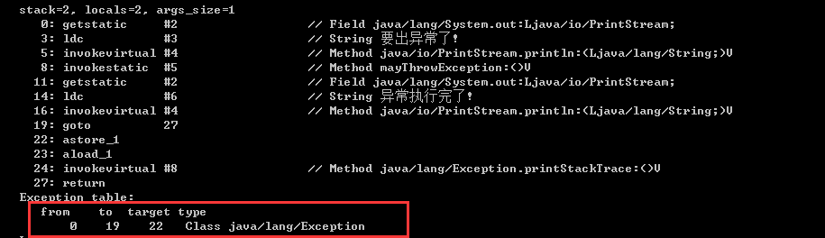
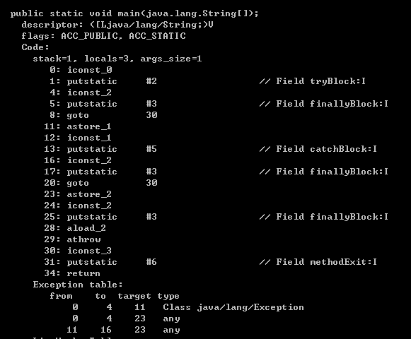

异常分类：  

    检查异常和非检查异常。或者显式异常和隐式异常。
显式异常：  
    
    抛出异常的主体是应用程序。throw手动抛出的异常。
隐式异常：  
    
    抛出异常的主体是java虚拟机。它指的是java虚拟机在执行过程中，碰到无法继续执行的异常状态，自动抛出异常。
检查异常：
     
     IOException、TimeoutException、SQLException、InterruptedException、FileNotFoundException、CloneNotSupportedException、ClassNotFoundException、NoSuchMetodException
非检查型异常：
    
    继承RuntimeException的异常。IndexOutOfBoundsException、ArithmeticException、NullPointException、ClassCastException

当程序抛出Error时，程序的执行状态已经无法恢复，需要中止线程甚至虚拟机。当程序出现Exception时，程序可能需要捕获并处理。

异常实例的构造很消耗性能，在构造异常实例时，java虚拟机需要生成该异常的栈轨迹，该操作会逐一访问当前线程的java栈帧，并且记录下各种  
调试信息，包括栈帧所指向方法的名字、方法所在的类名、文件名、以及在代码中的第几行触发该异常。在生成栈轨迹时，java虚拟机会忽略掉异常  
构造器以及填充栈帧的java方法，直接从新建异常的位置开始算起。java虚拟机会忽略标记为不可见的java方法栈帧。如果Lambda。  

#### java虚拟机怎么捕获异常
在编译生成的字节码中，每个方法都附带一个**异常表**。异常表中的每一个条目代表一个异常处理器，并且由from指针、to指针、target指针以及所捕获的  
异常类型构成，这些指针的值是字节码索引，用以定位字节码。  
from指针和to指针标示了该异常处理器所监控的范围。target指针则指向异常处理器的起始位置。如：catch代码块的起始位置。如下图所示例子：  
当程序触发异常时，java虚拟机会从上至下遍历异常表中的所有条目。当触发异常的字节码的索引值在某个异常表条目的监控范围内，java虚拟机会判断所抛出的
异常是否匹配。如果匹配，java虚拟机会将控制流转移至该条目target指针指向的字节码。
如果遍历完所有异常条目,java虚拟机仍未匹配到异常处理器，那么它会弹出当前方法对应的java栈帧，并且在调用者中重复上述操作，在最坏情况下，java虚拟机
需要遍历当前线程java栈上所有方法的异常表。

try catch finally的执行过程：每个try和catch的代码块后面都会跟着一个finally块的内容。

  
如果catch代码块捕获了异常，并且触发了另一个异常，那么finally捕获并且重抛的异常是后者的。
java7的语法糖。Supressed异常。try-with-resources 以及多异常捕获。

 
使用异常捕获的代码为什么比较耗费性能  
因为JVM在构造异常实例时需要生成该异常的栈轨迹。这个操作会逐一访问当前线程的栈帧，并且记录下各种调试信息，包括栈帧所指向方法的名字，方法所在的类名、文件名，以及在代码中的第几行触发该异常等信息。

finally是怎么实现无论异常与否都能被执行的
编译器在编译Java代码时，会复制finally代码块的内容，然后分别放在try-catch代码块所有的正常执行路径及异常执行路径的出口中。

异常表不是声明这段代码所有有可能抛出的异常，而是声明会被捕获的异常。
